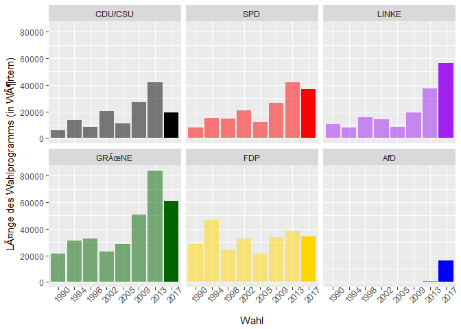
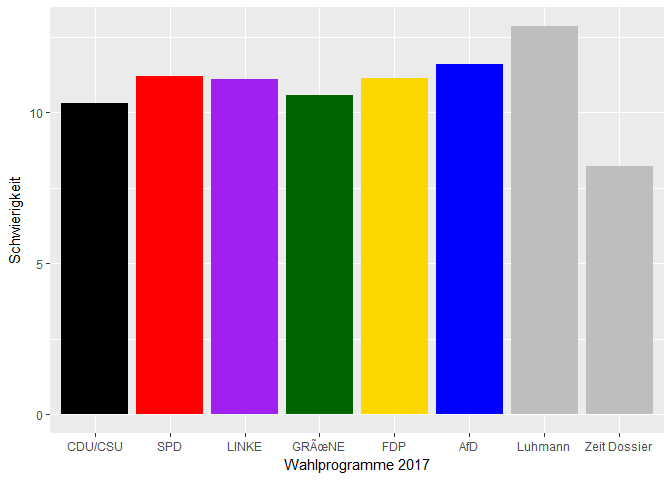
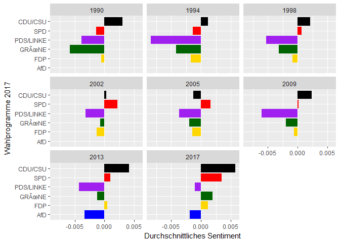

Analysis of 2017 German electoral programs
==========================================

This repository contains machine-readable versions of the 2017 manifestos of the six major German parties and an R script that performs various methods of automatic content analysis on these documents. Results of this analysis will be published by ZEIT online.

To be able to run the analysis, you need a valid Manifesto Project API key. Register for free, to get an API key on: <https://manifesto-project.wzb.eu/>

Length
------

Readability
-----------

Longest Sentences
-----------------

> Auch die Aus- und Weiterbildung der Lehrkräfte wollen wir entsprechend weiterentwickeln, denn Lehrerinnen und Lehrer müssen sich immer wieder auf neue Herausforderungen einstellen – auf die kulturelle Vielfalt und die Vielfalt von Lebensmodellen an ihrer Schule, auf das gemeinsame Lernen von Kindern mit und ohne Behinderung, auf ganztägigen Unterricht oder auf neue Entwicklungen in der digitalen Bildung. (SPD Wahlprogramm 2017 - Abschnitt Beste Schulen:)

> Finanzielle Spielräume, die sich aufgrund der guten Wirtschaftslage ergeben, nutzen wir zur Erfüllung unserer staatlichen Aufgaben nach innen und außen, für Investitionen in Bildung, Forschung und Infrastruktur, zur Förderung von Familien und Kindern sowie für Steuersenkungen, die vor allem der arbeitenden Mitte unserer Gesellschaft zugutekommen sollen. (CDU/CSU Wahlprogramm 2017 - Abschnitt Solide Staatsfinanzen)

> Deutschland hat wegen der beispiellosen Verbrechen der Deutschen an den Jüdinnen und Juden, wegen der Entfesselung des Zweiten Weltkrieges und den daraus resultierenden Verbrechen an den Völkern Europas – besonders massenhaft an den Völkern der Sowjetunion, an den Sinti und Roma, an politisch Andersdenkenden, behinderten Menschen und Homosexuellen – eine besondere Verantwortung und muss jeder Art von Menschenfeindlichkeit, Antisemitismus, Antiziganismus und Rassismus entgegentreten. (LINKE Wahlprogramm 2017 - Abschnitt **Rechte Gewalt stoppen: Antifaschismus ist gelebte Demokratie**)

> (GRÜNE Wahlprogramm 2017 - Abschnitt )

> Als entscheidende Punkte im steuerrechtlichen Bereich in diesem Venture-Capital-Gesetz, sehen wir den Abbau der Substanzbesteuerung – wie etwa bei den Hinzurechnungsvorschriften in der Gewerbesteuer, eine transparente Besteuerung für Venture Capital-Gesellschaften, eine faire Besteuerung von Investoren, die sich von ihrer Beteiligung trennen, ein Ende der (steuerlichen) Diskriminierung von Eigenkapital gegenüber Fremdkapital, die steuerliche Anrechenbarkeit von Investitionen in Unternehmen, eine Vereinheitlichung der gesetzlichen Rahmenbedingungen mindestens innerhalb der EU, keine Einschränkungen bei Verlustvorträgen, die Bilanzierbarkeit von Investitionen in eigene Intellectual Property und die Liberalisierung bei den Kapitalsammelstellen, damit privates Anlagekapital stärker genutzt werden kann. (FDP Wahlprogramm 2017 - Abschnitt Bessere Bedingungen für Wagniskapital)

> Zur Entlastung der innerdeutschen Justizvollzugsanstalten, aber auch zur Erhöhung der Abschreckungswirkung des Strafvollzuges, sind für ausländische Straftäter durch Vereinbarungen mit ausländischen, möglichst heimatnahen Staaten dort Vollzugsanstalten einzurichten, die den Anforderungen der EMRK entsprechen, unter deutscher Leitung und der Anwendung deutschen Rechts stehen und zu denen jederzeitiger Zugang zu dienstlichen Zwecken ebenso möglich ist wie der Besuch von Angehörigen und Rechtsanwälten. (AfD Wahlprogramm 2017 - Abschnitt 4.2 Vollstreckung im Ausland)

Sentiment
---------

Text similarity
---------------

Word frequencies (tf-idf)
-------------------------

    ## # A tibble: 11 x 6
    ## # Groups:   partyabbrev [1]
    ##    partyabbrev                 word_stem     n           tf       idf
    ##          <chr>                     <chr> <int>        <dbl>     <dbl>
    ##  1         AfD                     lehnt    11 0.0012613232 1.0986123
    ##  2         AfD         parteienfinanzier     6 0.0006879945 1.7917595
    ##  3         AfD                        gg     5 0.0005733287 1.7917595
    ##  4         AfD sozialversicherungsabkomm     5 0.0005733287 1.7917595
    ##  5         AfD                staatsvolk     5 0.0005733287 1.7917595
    ##  6         AfD                bundesbank     7 0.0008026602 1.0986123
    ##  7         AfD                      gend    11 0.0012613232 0.6931472
    ##  8         AfD              burgerarbeit     4 0.0004586630 1.7917595
    ##  9         AfD       sicherheitsstrategi     4 0.0004586630 1.7917595
    ## 10         AfD               wehrpflicht     4 0.0004586630 1.7917595
    ## 11         AfD          windenergieanlag     4 0.0004586630 1.7917595
    ## # ... with 1 more variables: tf_idf <dbl>

    ## # A tibble: 10 x 6
    ## # Groups:   partyabbrev [1]
    ##    partyabbrev       word_stem     n           tf       idf       tf_idf
    ##          <chr>           <chr> <int>        <dbl>     <dbl>        <dbl>
    ##  1     CDU/CSU      wahlperiod    14 0.0013872374 1.0986123 0.0015240361
    ##  2     CDU/CSU        marshall     4 0.0003963535 1.7917595 0.0007101702
    ##  3     CDU/CSU   baukindergeld     3 0.0002972652 1.7917595 0.0005326277
    ##  4     CDU/CSU   eindrucksvoll     3 0.0002972652 1.7917595 0.0005326277
    ##  5     CDU/CSU        fortgang     3 0.0002972652 1.7917595 0.0005326277
    ##  6     CDU/CSU          gipfel     3 0.0002972652 1.7917595 0.0005326277
    ##  7     CDU/CSU         realisi     3 0.0002972652 1.7917595 0.0005326277
    ##  8     CDU/CSU           seith     3 0.0002972652 1.7917595 0.0005326277
    ##  9     CDU/CSU unverwechselbar     3 0.0002972652 1.7917595 0.0005326277
    ## 10     CDU/CSU         kunftig    27 0.0026753864 0.1823216 0.0004877806

    ## # A tibble: 17 x 6
    ## # Groups:   partyabbrev [1]
    ##    partyabbrev              word_stem     n           tf       idf
    ##          <chr>                  <chr> <int>        <dbl>     <dbl>
    ##  1         SPD    familienarbeitszeit     6 0.0003126140 1.7917595
    ##  2         SPD           familiengeld     6 0.0003126140 1.7917595
    ##  3         SPD          familientarif     5 0.0002605116 1.7917595
    ##  4         SPD   gleichstellungspolit     5 0.0002605116 1.7917595
    ##  5         SPD                      q     5 0.0002605116 1.7917595
    ##  6         SPD       regelaltersgrenz     5 0.0002605116 1.7917595
    ##  7         SPD            solidarrent     5 0.0002605116 1.7917595
    ##  8         SPD           zusammenhalt    20 0.0010420466 0.4054651
    ##  9         SPD           gewerkschaft    19 0.0009899443 0.4054651
    ## 10         SPD                anstand     4 0.0002084093 1.7917595
    ## 11         SPD               aufgreif     4 0.0002084093 1.7917595
    ## 12         SPD                 brandt     4 0.0002084093 1.7917595
    ## 13         SPD einwanderungsgeschicht     4 0.0002084093 1.7917595
    ## 14         SPD            kinderbonus     4 0.0002084093 1.7917595
    ## 15         SPD        sozialdemokrati     4 0.0002084093 1.7917595
    ## 16         SPD                  willy     4 0.0002084093 1.7917595
    ## 17         SPD              zielgenau     4 0.0002084093 1.7917595
    ## # ... with 1 more variables: tf_idf <dbl>

    ## # A tibble: 10 x 6
    ## # Groups:   partyabbrev [1]
    ##    partyabbrev      word_stem     n           tf       idf       tf_idf
    ##          <chr>          <chr> <int>        <dbl>     <dbl>        <dbl>
    ##  1         FDP          weltb    23 0.0012834105 1.7917595 0.0022995630
    ##  2         FDP     burgergeld     7 0.0003906032 1.7917595 0.0006998670
    ##  3         FDP     zeitarbeit     7 0.0003906032 1.7917595 0.0006998670
    ##  4         FDP studienbeitrag     6 0.0003348027 1.7917595 0.0005998860
    ##  5         FDP        studier    25 0.0013950114 0.4054651 0.0005656285
    ##  6         FDP      vorankomm     9 0.0005022041 1.0986123 0.0005517276
    ##  7         FDP  unkompliziert    13 0.0007254059 0.6931472 0.0005028131
    ##  8         FDP        capital     5 0.0002790023 1.7917595 0.0004999050
    ##  9         FDP            esm     5 0.0002790023 1.7917595 0.0004999050
    ## 10         FDP         ventur     5 0.0002790023 1.7917595 0.0004999050

    ## # A tibble: 10 x 6
    ## # Groups:   partyabbrev [1]
    ##    partyabbrev      word_stem     n           tf       idf       tf_idf
    ##          <chr>          <chr> <int>        <dbl>     <dbl>        <dbl>
    ##  1       LINKE     ostdeutsch    22 0.0007394212 1.7917595 0.0013248650
    ##  2       LINKE     erwerbslos    35 0.0011763520 1.0986123 0.0012923547
    ##  3       LINKE         profit    30 0.0010083017 1.0986123 0.0011077326
    ##  4       LINKE ostdeutschland    16 0.0005377609 1.7917595 0.0009635382
    ##  5       LINKE     neoliberal    25 0.0008402514 1.0986123 0.0009231105
    ##  6       LINKE        solidar    67 0.0022518738 0.4054651 0.0009130562
    ##  7       LINKE     gefluchtet    39 0.0013107922 0.6931472 0.0009085719
    ##  8       LINKE  mindestsicher    15 0.0005041508 1.7917595 0.0009033170
    ##  9       LINKE    niedriglohn    14 0.0004705408 1.7917595 0.0008430959
    ## 10       LINKE   gewerkschaft    48 0.0016132827 0.4054651 0.0006541298

    ## # A tibble: 10 x 6
    ## # Groups:   partyabbrev [1]
    ##    partyabbrev  word_stem     n           tf       idf       tf_idf
    ##          <chr>      <chr> <int>        <dbl>     <dbl>        <dbl>
    ##  1      GRÃ<U+009C>NE       grun   226 0.0070514821 0.1823216 0.0012856372
    ##  2      GRÃ<U+009C>NE     stimmt    25 0.0007800312 1.0986123 0.0008569519
    ##  3      GRÃ<U+009C>NE      wahlt    24 0.0007488300 1.0986123 0.0008226738
    ##  4      GRÃ<U+009C>NE gefluchtet    36 0.0011232449 0.6931472 0.0007785741
    ##  5      GRÃ<U+009C>NE   bauerinn    11 0.0003432137 1.7917595 0.0006149564
    ##  6      GRÃ<U+009C>NE     lsbtiq    11 0.0003432137 1.7917595 0.0006149564
    ##  7      GRÃ<U+009C>NE  selbstand    28 0.0008736349 0.6931472 0.0006055576
    ##  8      GRÃ<U+009C>NE  klimakris    17 0.0005304212 1.0986123 0.0005827273
    ##  9      GRÃ<U+009C>NE innenrecht    10 0.0003120125 1.7917595 0.0005590513
    ## 10      GRÃ<U+009C>NE         vn    15 0.0004680187 1.0986123 0.0005141711

Method
======

### Length

Number of words

### Readability

[Vierte Wiener Sachtextformel](wikipedia-link)

### Sentiment

[SentimentWortschatz](http://wortschatz.informatik.uni-leipzig.de/)

### Similarity

Jaccard-Bag-Similarity

### wordfrequencies

tfidf
